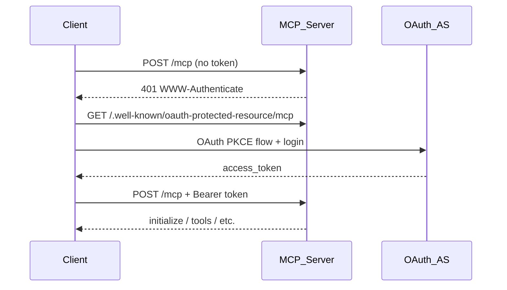

# MCP Server

Standalone hello-world MCP server on **Streamable HTTP** with **OAuth 2.1** authorization. Implements MCP protocol version `2025-11-25` for protocol compatibility testing.

## Features

| Area | Details |
|------|---------|
| **Transport** | Streamable HTTP at `/mcp` (no stdio) |
| **Authorization** | OAuth 2.1 with PKCE S256, RFC 9728 protected-resource metadata, RFC 8414 AS metadata |
| **Tools** | `get_name` |
| **Prompts** | `hello` |
| **Resources** | `mcp://hello-world/server-info` |
| **Utilities** | Logging (`logging/setLevel`), completion |

## Configuration

Edit `config.toml` before starting:

```toml
addr = "0.0.0.0:9191"
public_url = "http://127.0.0.1:9191"
username = "Paval"
password = "1234"
token_ttl_secs = 120
scope = "mcp"
allowed_origins = []
```

| Field | Description |
|-------|-------------|
| `addr` | Bind address (e.g. `127.0.0.1:9191` behind a reverse proxy) |
| `public_url` | Public origin for OAuth metadata — **scheme + host + port only, no path** |
| `username` / `password` | Single-owner credentials for the OAuth consent page |
| `token_ttl_secs` | Access-token lifetime in seconds |
| `scope` | OAuth scope advertised to clients |
| `allowed_origins` | Browser origins for Streamable HTTP Origin validation (empty = default) |

`allowed_hosts` is derived automatically from `public_url` and `addr`.

## Running

From the workspace root:

```bash
cargo run -p mcp -- --config mcp/config.toml
```

Startup logs include:

- MCP endpoint: `http://127.0.0.1:9191/mcp`
- Protected resource metadata: `http://127.0.0.1:9191/.well-known/oauth-protected-resource/mcp`
- OAuth AS metadata: `http://127.0.0.1:9191/.well-known/oauth-authorization-server`

## Connecting

### Endpoints

| Purpose | URL |
|---------|-----|
| **MCP (Streamable HTTP)** | `http://127.0.0.1:9191/mcp` |
| OAuth discovery (AS) | `http://127.0.0.1:9191/.well-known/oauth-authorization-server` |
| Protected resource (RFC 9728) | `http://127.0.0.1:9191/.well-known/oauth-protected-resource/mcp` |
| Login / consent | `http://127.0.0.1:9191/oauth/authorize` |

Every MCP request requires `Authorization: Bearer <token>`.

### MCP Inspector

[MCP Inspector](https://modelcontextprotocol.io/docs/tools/inspector) supports remote OAuth servers.

1. Start the server.
2. Run the inspector (see MCP docs for the current command).
3. Set server URL to `http://127.0.0.1:9191/mcp`.
4. Complete OAuth when prompted (login with `username` / `password` from config).
5. Inspector obtains a token and talks MCP over Streamable HTTP.

### IDE / OAuth-capable clients

Provide the MCP URL:

```text
http://127.0.0.1:9191/mcp
```

The client should:

1. Call `/mcp` without a token → receive `401` + `WWW-Authenticate` with `resource_metadata`
2. Discover OAuth via RFC 9728 / RFC 8414
3. Run authorization code + PKCE
4. Call `/mcp` with the Bearer token

`public_url` must match what the client uses to reach the server.

### Manual check

**Metadata:**

```bash
curl -s http://127.0.0.1:9191/.well-known/oauth-protected-resource/mcp | jq
```

**Unauthenticated MCP (expect 401):**

```bash
curl -i -X POST http://127.0.0.1:9191/mcp \
  -H "Content-Type: application/json" \
  -H "Accept: application/json, text/event-stream" \
  -d '{"jsonrpc":"2.0","id":1,"method":"initialize","params":{"protocolVersion":"2025-11-25","capabilities":{},"clientInfo":{"name":"test","version":"0.1.0"}}}'
```

After OAuth, repeat with `-H "Authorization: Bearer <access_token>"`.

### OAuth flow



### Limitations

- **No stdio transport** — Streamable HTTP only.
- **OAuth required** — unauthenticated MCP calls are rejected.
- **Bind vs public URL** — connect via the host in `public_url`, or update `public_url` and `allowed_hosts` when using another host/IP.
- **Token lifetime** — refresh via `refresh_token` when `token_ttl_secs` expires.

## `public_url` and paths

`public_url` must be **origin only** (scheme + host + optional port):

```toml
public_url = "https://example.com"
# or
public_url = "https://mcp.example.com"
```

Paths are rejected at startup:

```toml
public_url = "https://example.com/mcp"   # invalid
```

The server appends paths in code:

| Purpose | URL |
|---------|-----|
| MCP endpoint (client connects here) | `https://example.com/mcp` |
| OAuth issuer | `https://example.com` |
| Token / authorize | `https://example.com/oauth/...` |
| Protected resource metadata | `https://example.com/.well-known/oauth-protected-resource/mcp` |

| Config | Supported? |
|--------|------------|
| `https://example.com` | Yes |
| `https://mcp.example.com` | Yes |
| `https://example.com:8443` | Yes |
| `https://example.com/mcp` | No (validation error) |
| Client connects to `https://example.com/mcp` | Yes (with `public_url = "https://example.com"`) |

Path prefixes like `https://example.com/apps/mcp` are **not supported** without code changes.

## Caddy reverse proxy

### Architecture

```text
Client ──HTTPS──► Caddy (example.com:443)
                      │
                      └── HTTP ──► mcp binary (127.0.0.1:9191)
```

Caddy terminates TLS. The Rust server stays on loopback without TLS.

### Production config

```toml
addr = "127.0.0.1:9191"
public_url = "https://example.com"
username = "your-user"
password = "your-strong-password"
token_ttl_secs = 3600
scope = "mcp"
allowed_origins = []
```

- Bind to `127.0.0.1`, not `0.0.0.0`, when only Caddy is public.
- `public_url` is the origin only (no `/mcp` path).
- `allowed_hosts` is derived from `public_url`, so `Host: example.com` from Caddy is accepted.

### Caddyfile

```caddyfile
example.com {
    # OAuth login page + consent form
    handle /oauth/* {
        reverse_proxy 127.0.0.1:9191 {
            flush_interval -1
        }
    }

    # RFC 8414 / RFC 9728 discovery
    handle /.well-known/* {
        reverse_proxy 127.0.0.1:9191
    }

    # MCP Streamable HTTP (POST + SSE GET)
    handle /mcp {
        reverse_proxy 127.0.0.1:9191 {
            flush_interval -1
        }
    }
    handle /mcp/* {
        reverse_proxy 127.0.0.1:9191 {
            flush_interval -1
        }
    }

    # Deny everything else on this host
    handle {
        respond "Not Found" 404
    }
}
```

`flush_interval -1` prevents SSE streams used by Streamable HTTP from buffering behind the proxy.

Reload Caddy:

```bash
caddy validate --config /etc/caddy/Caddyfile
sudo systemctl reload caddy
```

### Paths to proxy

| Path | Purpose |
|------|---------|
| `/mcp` | MCP Streamable HTTP endpoint |
| `/oauth/*` | Register, authorize, approve, token |
| `/.well-known/oauth-authorization-server` | OAuth AS metadata |
| `/.well-known/oauth-protected-resource` | RFC 9728 (root) |
| `/.well-known/oauth-protected-resource/mcp` | RFC 9728 (path-scoped) |

Client MCP URL: `https://example.com/mcp`

### Verify behind Caddy

```bash
curl -s https://example.com/.well-known/oauth-protected-resource/mcp | jq

curl -i -X POST https://example.com/mcp \
  -H "Content-Type: application/json" \
  -H "Accept: application/json, text/event-stream" \
  -d '{"jsonrpc":"2.0","id":1,"method":"initialize","params":{"protocolVersion":"2025-11-25","capabilities":{},"clientInfo":{"name":"test","version":"0.1.0"}}}'
```

After OAuth, the same request with `Authorization: Bearer <token>` should return the `initialize` result.

### OAuth redirect URIs

MCP clients register redirect URIs like `http://127.0.0.1:<port>/callback` or `http://localhost:<port>/callback`. Those go to the client, not Caddy — no extra Caddy config for them.

The browser login flow hits `https://example.com/oauth/authorize`, so `public_url` must be `https://example.com`.

### systemd example

```ini
# /etc/systemd/system/mcp.service
[Unit]
Description=MCP hello-world server
After=network.target

[Service]
User=mcp
WorkingDirectory=/opt/quasi-bots
ExecStart=/opt/quasi-bots/target/release/mcp --config /etc/mcp/config.toml
Restart=on-failure

[Install]
WantedBy=multi-user.target
```

### Subdomain variant

```caddyfile
mcp.example.com {
    reverse_proxy 127.0.0.1:9191 {
        flush_interval -1
    }
}
```

```toml
public_url = "https://mcp.example.com"
```

Client URL: `https://mcp.example.com/mcp`

### Common pitfalls

| Issue | Fix |
|-------|-----|
| OAuth metadata shows `http://127.0.0.1:9191` | Set `public_url = "https://example.com"` |
| 403 from MCP on valid requests | `Host` must match `public_url` host; do not rewrite `Host` to `127.0.0.1` in Caddy |
| SSE / stream hangs | Use `flush_interval -1` on `/mcp` |
| Path prefix like `example.com/apps/mcp` | Not supported today |
| `public_url = "https://example.com/mcp"` | Invalid — validator rejects paths in `public_url` |